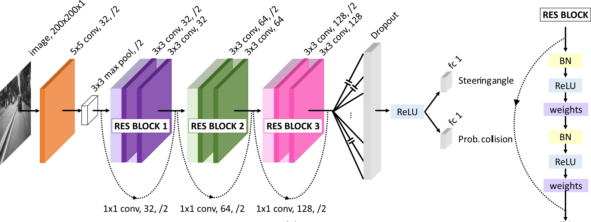
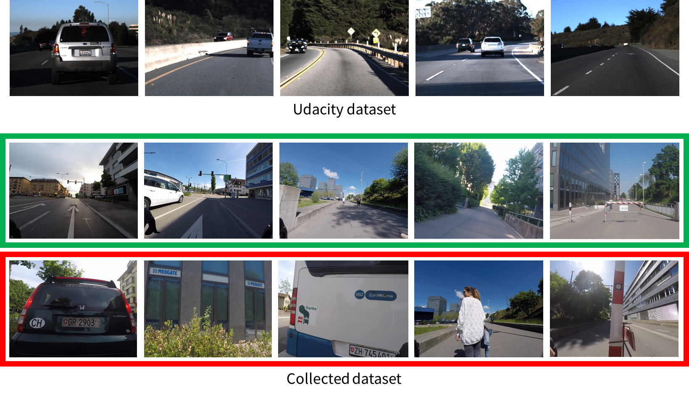

# DroNet: Learning to fly by driving
This repository contains the code used to train and evaluate DroNet, a convolutional neural network that can safely drive a drone along the streets of a city.

#### Citing

If you use DroNet in an academic context, please cite the following publication:

Paper: [DroNet:Learning to Fly by Driving](http://rpg.ifi.uzh.ch/docs/RAL18_Loquercio.pdf)

Video: [YouTube](https://youtu.be/ow7aw9H4BcA)

```
@article{Loquercio_2018,
	doi = {10.1109/lra.2018.2795643},
	year = 2018,
	author = {Antonio Loquercio and Ana Isabel Maqueda and Carlos R. Del Blanco and Davide Scaramuzza},
	title = {Dronet: Learning to Fly by Driving},
	journal = {{IEEE} Robotics and Automation Letters}
}
```

## Introduction
Due to the danger that flying a drone can cause in an urban environment, collecting training data results impossible. For that reason, DroNet learns how to fly by imitating the behavior of manned vehicles that are already integrated in such environment. It produces a steering angle and a collision probability for the current input image captured by a forward-looking camera. Then, these high-level commands are transferred to control commands so that the drone keeps navigating, while avoiding obstacles.

### Model
DroNet has been designed as a forked CNN that predicts, from a single 200×200 frame in gray-scale, a steering angle and a collision probability. The shared part of the architecture consists of a fast ResNet-8 with 3 residual blocks, followed by dropout and ReLU non-linearity. After them, the network branches into two separated fully-connected layers, one to carry out steering prediction, and the other one to infer collision probability. See ```cnn_models.py``` for more details.



### Data
In order to learn steering angles, the publicly available [Udacity dataset](https://github.com/udacity/self-driving-car/tree/master/datasets/CH2) has been used. It provides several hours of video recorded from a car. We additionally recorded an outdoor dataset to learn the probability of collision by riding a bicycle in the streets of our city.



## Running the code

### Software requirements
This code has been tested on Ubuntu 14.04, and on Python 3.4.

Dependencies:
* TensorFlow 1.5.0
* Keras 2.1.4 (Make sure that the Keras version is correct!)
* NumPy 1.12.1
* OpenCV 3.1.0
* scikit-learn 0.18.1
* Python gflags


### Data preparation

#### Steering data
Once Udacity dataset is downloaded, extract the contents from each rosbag/experiment. To have instructions on how to do it, please follow the instructions from the [udacity-driving-reader](https://github.com/rwightman/udacity-driving-reader), to dump images + CSV.
After extraction, you will only need ```center/``` folder and ```interpolated.csv``` file from each experiment to create the steeering dataset.
To prepare the data in the format required by our implementation, follow these steps:

1. Rename the ```center/``` folder to ```images/```.
2. Process the ```interpolated.csv``` file to extract data corresponding only to the central camera. It is important to sync images and the corresponding steerings matching their timestamps. You can use the script [time_stamp_matching.py](data_preprocessing/time_stamp_matching.py) to accomplish this step. 

The final structure of the steering dataset should look like this:
```
training/
    HMB_1_3900/*
        images/
        sync_steering.txt
    HMB_2/
    HMB_4/
    HMB_5/
    HMB_6/
validation/
    HMB_1_501/*
testing/
    HMB_3/
```
*Since Udacity dataset does not provide validation experiments, we split HMB_1 so that the first 3900 samples are used for training and the rest for validation.

#### Collision data
Collision dataset is ready to be used after downloading. It can be directly downloaded from [here](http://rpg.ifi.uzh.ch/data/collision.zip). Its structure is as follows:
```
training/
    DSCN2561/
        images/
        labels.txt
    DSCN2562/
    ...
    GOPR0387/
validation/
    DSCN2682/
    GOPR0227/
testing/
    DSCN2571/
    GOPR0200/
    ...
    GOPR0386/
```

<!--
Additionally, you can find the raw video data used to create the dataset [here](put link!). It could be helpful in case you want to use the dataset in a different way. Note that for all our exeperiments, we resize all videos to the shape 720x960.
videos/*
   DSCN2561.MOV
   DSCN2562.MOV
   ...
   GOPR0387.MP4
-->

Finally, merge the ```training/```, ```validation/``` and ```testing/``` directories from both datasets, and use them to train and evalutate DroNet.


### Training DroNet
1. Train DroNet from scratch:
```
python cnn.py [flags]
```
Use ```[flags]``` to set batch size, number of epochs, dataset directories, etc. Check ```common_flags.py``` to see the description of each flag, and the default values we used for our experiments.

Example:
```
python cnn.py --experiment_rootdir='./model/test_1' --train_dir='../training' --val_dir='../validation' --batch_size=16 --epochs=150 --log_rate=25 
```

2. Fine-tune DroNet by loading a pre-trained model:
```
python cnn.py --restore_model=True --experiment_rootdir='./model' --weights_fname='model_weights.h5'
```
The pre-trained model must be in the directory you indicate in ```--experiment_rootdir```.

### Evaluating DroNet
We evaluate our model on the testing data from each dataset.
```
python evaluation.py [flags]
```
Example:
```
python evaluation.py --experiment_rootdir='./model' --weights_fname='model_weights.h5' --test_dir='../testing' 
```

### Download our trained model 
A folder containing the trained model that we used in our real world experiments can be download here: [best_model](http://rpg.ifi.uzh.ch/data/dronet_model.zip).
To evaluate it, use the following command:
```
python evaluation.py --experiment_rootdir=PATH_TO_FOLDER --weights_fname=best_weights.h5 --test_dir='../testing' 
```

### Test dronet on a real robot
In the folder [drone_control](./drone_control/dronet) you can find instructions on how to use DroNet to fly a [Bebop](http://global.parrot.com/au/products/bebop-drone/) drone.

